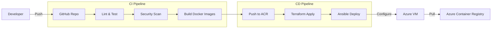

# System Architecture

This document describes the architecture of the DevOps Pipeline Project, including the application stack, infrastructure, and CI/CD pipelines.

## High-Level Architecture

The system is designed as a 3-tier web application hosted on Azure, managed by Terraform and Ansible, and deployed via GitHub Actions.

```mermaid
graph TD
    User[User] -->|HTTP/80| LB[Azure Load Balancer / Public IP]
    LB -->|HTTP/80| VM[Azure VM (Ubuntu 22.04)]
    
    subgraph "Azure VM"
        Nginx[Frontend Container]
        Node[Backend Container]
        DB[PostgreSQL Container]
        
        Nginx -->|Proxy/3000| Node
        Node -->|TCP/5432| DB
    end
    
    subgraph "Azure Infrastructure"
        ACR[Azure Container Registry]
        NSG[Network Security Group]
        VNet[Virtual Network]
    end
    
    VM -->|Pull Images| ACR
    NSG -->|Filter Traffic| VM
    VM -->|Inside| VNet
```

## Infrastructure Architecture

The infrastructure is provisioned using Terraform and consists of the following Azure resources:

*   **Resource Group**: Logical container for all resources.
*   **Virtual Network (VNet)**: Isolated network environment.
*   **Subnet**: Subnet for the Virtual Machine.
*   **Network Security Group (NSG)**: Firewall rules to control traffic (Allow SSH, HTTP, HTTPS, App Port).
*   **Public IP**: Static IP address for the VM.
*   **Network Interface (NIC)**: Connects the VM to the VNet.
*   **Virtual Machine**: Ubuntu 22.04 LTS server hosting the application.
*   **Azure Container Registry (ACR)**: Stores private Docker images.

## CI/CD Pipeline Architecture

The CI/CD pipeline is implemented using GitHub Actions.



### Workflow Details

1.  **Terraform Workflow** (`terraform.yml`):
    *   **Plan**: Validates configuration and previews changes.
    *   **Security**: Scans IaC with tfsec and Checkov.
    *   **Apply**: Provisions/updates infrastructure on main branch.

2.  **CD Pipeline** (`cd-pipeline.yml`):
    *   **Build & Push**: Builds Docker images and pushes to ACR with version tags.
    *   **Image Scan**: Scans images with Trivy.
    *   **Deploy**: Uses Ansible to configure the VM and deploy the application stack.
    *   **Verify**: Runs smoke tests against the deployed application.

3.  **Security Workflow** (`security.yml`):
    *   **Dependency Scan**: Checks npm packages.
    *   **SAST**: CodeQL analysis.
    *   **Secret Scan**: TruffleHog.
    *   **Container Scan**: Trivy.
    *   **IaC Security**: tfsec/ansible-lint.

4.  **DAST Workflow** (`dast.yml`):
    *   **OWASP ZAP**: Performs dynamic security scanning against the running application.

## Application Stack

*   **Frontend**: React application served by Nginx (or Node.js static server).
*   **Backend**: Node.js Express REST API.
*   **Database**: PostgreSQL 15.

## Network Flow

1.  **Inbound**:
    *   SSH (Port 22): Allowed from any source (restricted in production).
    *   HTTP (Port 80): Allowed for web access.
    *   App (Port 3000): Allowed for API access (optional, usually proxied via 80).
2.  **Outbound**:
    *   Allowed for system updates and image pulling.
